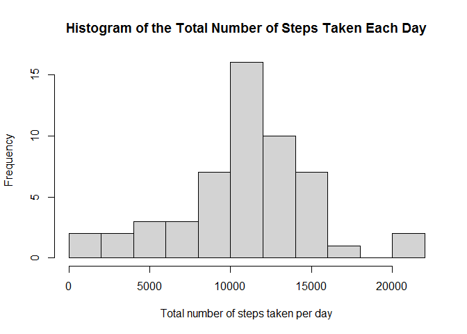
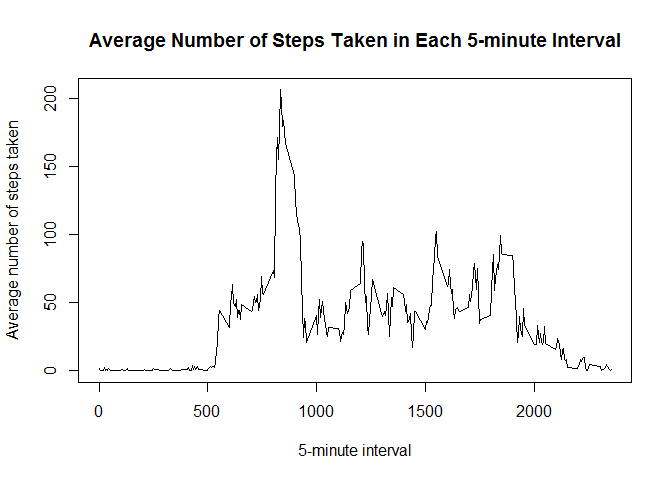
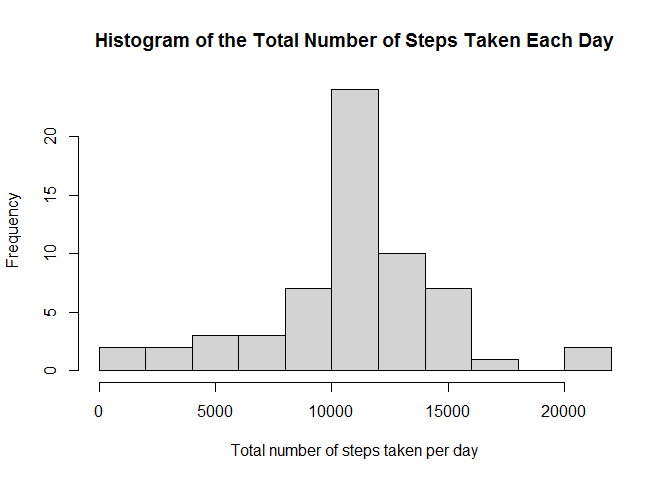
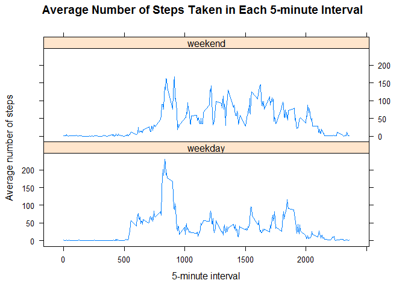

## Setup
Working environment:  
R version 4.0.2 (2020-06-22) -- "Taking Off Again"  
Windows 8

NOTE: as per instructions there should be a figure folder once the Rmd is knitted into html. However, this template Rmd provided for the project is no longer v1 Rmd but v2. Therefore instead of the figure directory I have PA1_template_files that contains the figures shown in the output PA1_template.html file.


```r
# Load needed packages. Warnings and messages due to loading packages are suppressed.
library(dplyr)
library(lattice)
library(knitr)

# Set global options
opts_chunk$set(echo=TRUE, message=FALSE)
```

## Loading and preprocessing the data
It is assumed that the data is unzipped and available locally in the working directory of the active R session.


```r
# Load the data
activity <- read.csv(file="activity.csv", header=TRUE)

# Convert dates
activity <- mutate(activity, date=as.Date(date, "%Y-%m-%d"))
```

## What is mean total number of steps taken per day?
For this part of the assignment, the missing values are ignored in the activity dataset in accordance with the instructions.


```r
# Calculate total number of steps taken per day, excluding missing (NA) values
total_daily_steps <- activity %>% 
                     filter(!is.na(steps)) %>%
                     group_by(date) %>%
                     summarise(total=sum(steps))

# Histogram of the total number of steps taken each day
with(total_daily_steps, hist(total, breaks = 10,
                             main = "Histogram of the Total Number of Steps Taken Each Day",
                             xlab = "Total number of steps taken per day"
                             )
     )
```

<!-- -->

```r
# Mean and median of the total number of steps taken per day
mean_total_daily_steps <- mean(total_daily_steps$total)
median_total_daily_steps <- median(total_daily_steps$total)
```
Mean and median of the total number of steps taken per day are **10766.19** and **10765** steps respectively.

## What is the average daily activity pattern?

```r
# Calculate average number of steps taken per interval, excluding missing (NA) values
avg_steps <- activity %>% 
             filter(!is.na(steps)) %>% 
             group_by(interval) %>%
             summarise(avg_step=mean(steps))

# Time series plot
with(avg_steps, plot(interval, avg_step, type = "l", 
                     main = "Average Number of Steps Taken in Each 5-minute Interval",
                     xlab = "5-minute interval", 
                     ylab = "Average number of steps taken"))
```

<!-- -->

```r
# Interval with maximum average number of steps during the day
max_avg_step <- avg_steps[order(avg_steps$avg_step, decreasing = TRUE)[1],]
```
Interval **835** contains the maximum number of steps (206.1698), on average across all days in the dataset.

## Imputing missing values

```r
# Number of missing values
n_miss <- sum(is.na(activity$steps))
```
Number of missing values in the data: **2304**

Missing values will be imputed as the mean for that 5-minute interval of the available data.

```r
# Merge average number of steps to rows with missing value
activity_help1 <- merge(activity[is.na(activity$steps),], avg_steps, by = "interval")
activity_help1 <- activity_help1 %>%
                  select(avg_step, date, interval) %>% # Select the needed columns
                  rename(steps=avg_step) %>% # Rename avg_steps to steps
                  mutate(imputed=TRUE) # Create a new variable to flag the imputed values

# Filter for rows with available data and create a new variable to flag that they are not imputed
activity_help2 <- activity[!is.na(activity$steps),]
activity_help2$imputed <- FALSE

# Put together imputed and non-imputed data
activity_imp <- rbind(activity_help1, activity_help2)
activity_imp <- arrange(activity_imp,date,interval)

# Calculate total number of steps taken per day, including imputed values
total_daily_steps_imp <- activity_imp %>% 
                         group_by(date) %>%
                         summarise(total=sum(steps))

# Histogram of the total number of steps taken each day
with(total_daily_steps_imp, hist(total, breaks = 10,
                                 main = "Histogram of the Total Number of Steps Taken Each Day",
                                 xlab = "Total number of steps taken per day"
                                 )
     )
```

<!-- -->

```r
# Mean and median of the total number of steps taken per day
mean_total_daily_steps_imp <- mean(total_daily_steps_imp$total)
median_total_daily_steps_imp <- median(total_daily_steps_imp$total)
```
Including the imputed values, the mean and median of the total number of steps taken per day are **10766.19** and **10766.19** steps respectively.
The mean stayed the same and the median very slightly increased (~ by one step). The imputation had no significant impact on the estimates of the total daily number of steps. This can be seen on the histogram as well since it hardly changed, too.

## Are there differences in activity patterns between weekdays and weekends?

```r
levels_help <- c("Monday", "Tuesday", "Wednesday", "Thursday", "Friday", "Saturday", "Sunday")
labels_help <- c("weekday", "weekday", "weekday", "weekday", "weekday", "weekend", "weekend")
activity_imp1 <- activity_imp %>%
                 mutate(daytype=factor(weekdays(date), 
                                       levels = levels_help,
                                       labels = labels_help
                                       )
                        ) %>%
                 group_by(daytype, interval) %>%
                 summarize(avg=mean(steps)) 

xyplot(avg ~ interval | daytype, activity_imp1, layout = c(1,2), type = "l",
       main = "Average Number of Steps Taken in Each 5-minute Interval",
       xlab = "5-minute interval",
       ylab = "Average number of steps")
```

<!-- -->

Yes, there are differences between weekdays and weekends. The peak average number of steps are taken around the same time. But walking activity starts earlier and stronger on weekdays and the peak is higher than on weekends. Then after 10:00 until the end of the day the average steps are almost always below the weekends' average steps. That shows that afternoons on the weekends are more active physically than during weekdays, on average.
